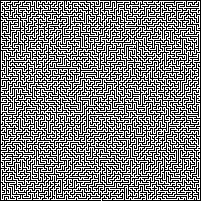

# Maze-Solver
Maze Solver using Pygame

## About  
---
This is a python maze solver script implemented using [Pygame](https://www.pygame.org/wiki/GettingStarted).

The maze can be initialized manually as a 2D matrix of **0** and **1**, or using **.jpg** or **.png** file.

Here is an example of a maze as matrix:

```python
 maze = [[1,0,1,1,1,0,0,0,1,1,0,0,1,1,0,0,0,1,1,1,0,1,1,0,0,0,1],
         [0,0,0,1,1,0,0,0,0,1,0,0,1,1,0,1,1,0,0,1,1,0,0,1,1,1,0],
         [1,0,0,1,1,1,1,1,0,1,0,0,1,0,0,1,0,0,1,0,0,1,0,1,0,0,1],
         [0,0,0,0,1,1,0,1,1,1,0,0,1,0,0,1,0,1,1,0,1,1,1,1,1,1,0],
         [1,0,1,0,1,0,1,0,0,1,0,0,1,1,1,1,1,0,0,1,1,0,0,0,0,0,0],
         [1,1,0,0,0,1,1,1,1,0,1,0,0,1,1,0,1,1,0,1,1,0,0,0,0,1,0],
         [1,0,0,0,1,0,1,0,0,1,0,1,1,0,0,0,1,0,1,0,1,0,0,0,1,1,0],
         [0,0,0,0,0,0,1,1,0,0,1,1,0,1,0,1,1,0,0,1,1,1,0,0,0,0,0],
         [0,0,0,0,0,0,0,1,0,1,1,0,1,0,1,1,0,1,1,0,1,1,1,0,0,1,0],
         [1,0,0,1,0,0,1,1,1,0,0,1,0,1,1,0,0,1,1,1,0,1,0,1,1,0,1]]
```

Here is an exmaple of maze as image:



The maze can be solved using the following algorithms:

## 1. **Treamaux Algorithm**

This is the standard recursive DFS algorithm that goes through all the possible paths, until the end of the maze is reached.    
<br />

## 2. **Wall Follower Algorithm**

This is standard maze-solving algorith that stick to a wall and follow it until it reaches the end of the maze. It is guaranted to find a solution if the start and end points are connected by walls. However, it is not guaranteed to find the shortest path.  
<br />

## 3. **A-Star Search Algorithm**

This is the best algorithm for finding the shortest path in a maze. It uses the heuristic function to find the best path. The heuristic function is a way to inform the search about the direction to a goal. It provides an informed way to guess which neighbor of a node will lead to a goal. Here, we use the carrthm distance between two nodes as the heuristic.  
<br />

## Usage Guide
---
Just un-comment the code you want to use and run the script.

Make sure to install [Pygame](https://www.pygame.org/wiki/GettingStarted) and [OpenCV](http://opencv.org/) first.
